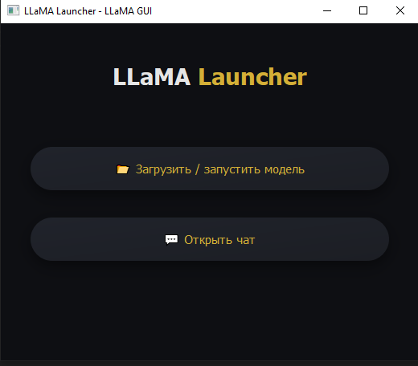
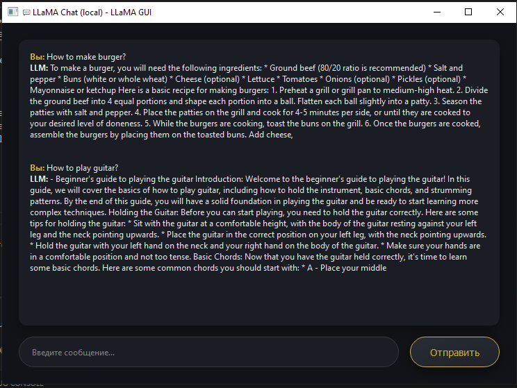

# LLaMA GUI

Desktop launcher for local LLaMA / GGUF models (PyQt 6)

Функциональность

🎨 Современный тёмный интерфейс с золотыми акцентами и плавным fade‑in

📂 Выбор любого .gguf / .ggml‑файла и (опционально) квантование в Q‑формат через llama_quantize.exe

🗨️ Окно чата с поддержкой многострочных ответов (до 256 токенов)

🔄 Подгрузка модели «лениво» — только при первом сообщении

# 🚀 Установка

1 — Клонировать проект

git clone https://github.com/PoGen-dev/llama_app.git
cd llama_app

2 — Создать виртуальное окружение (рекомендуется)

python -m venv .env
#### Windows
.venv\Scripts\activate
#### macOS / Linux
source .venv/bin/activate

3 — Поставить зависимости

pip install -U pip
pip install -r requirements.txt
#### wheel с уже скомпилированной llama.cpp (CPU)
pip install llama-cpp-python --extra-index-url \
  https://abetlen.github.io/llama-cpp-python/whl/cpu

🐧 GPU (CUDA ≥ 12.1) — установите драйвер и замените cpu на cu121 / cu122.

4 — Скачать модель (пример)

huggingface-cli login  # вставьте HF‑токен
huggingface-cli download TheBloke/Llama-2-7B-Chat-GGUF \
  llama-2-7b-chat.Q4_K_M.gguf --local-dir ./models

5 — Запустить приложение

python main.py

ИЛИ через запуск run.cmd

Нажмите «📂 Загрузить…», выберите файл модели — готово!

#### ⚙️ Квантование внутри GUI

Если указать FP16‑файл (без Q* в названии) и согласиться на квантование, приложение вызовет llama_app/llama-quantize.exe и создаст новый .Q4_K_M.gguf (или другой выбранный формат).

Убедитесь, что llama_app/llama-quantize.exe лежит в папке llama_app с main.py, иначе появится окно с ошибкой.

# Главное окно LLaMA GUI

# Чат LLaMA GUI

